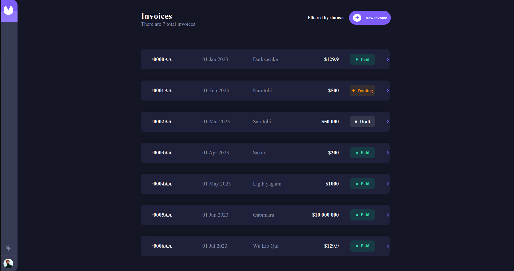
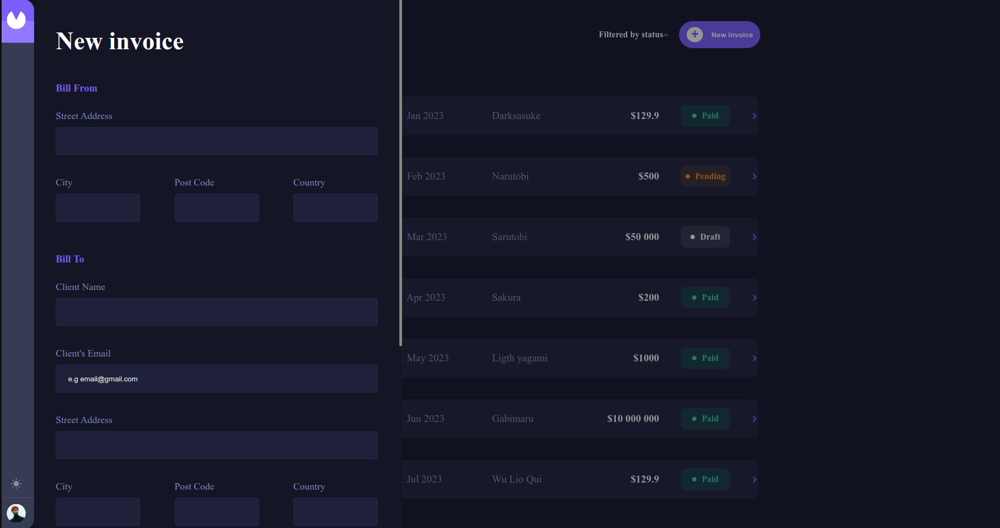
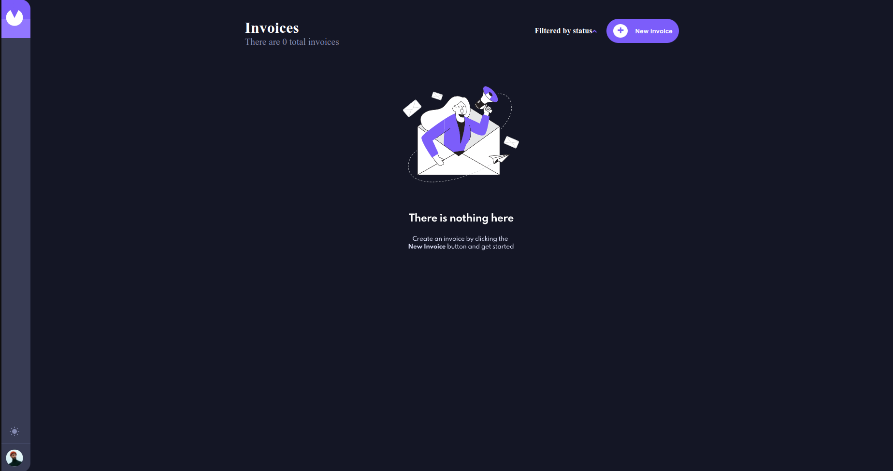

# Invoices

With the aim of learning the basics of Typescript and Redux Toolkit, I decided to follow a template on Figma proposed by a mentor. The main challenge was to work with Typescript and Redux Toolkit and then utilize them effectively. The project is currently 'viable' for a demonstration, but there are still some details to be addressed, such as refactoring (in progress), as well as correcting the values indicated in the initial demonstration invoices.
<br />
Here is the link to the Figma:
[https://www.figma.com/file/IkQoU1ZASKOlBnjYm7uyi8/invoice-app?type=design&node-id=0-1&mode=design&t=fq5AGdBGWyeaQKhv-0]

## Technology
<<<<<<< HEAD

=======

React ==> 
Typescript ==> 
Redux toolkit ==> 
Sass ==> 
>>>>>>> 1c5af43adb1ab7a5f82cd6639d482dd1f2ee12e9

## Description

Invoices allows you to manage your invoices (delete, add, modify).

## How to used it ?

To use the application, it's very simple. Just go to the website. [url soon].

## Project Structure
```
project
|── public
|── src
|   |── components
|   |── functions
|   |── style
|   └── types
|── App.tsx
|── main.tsx
|── redux.ts
|── package.json
└── README.md
```
## Features

- **Feature 1:** Use the form to create an invoice.
- **Feature 2:** Save or send the invoice.
- **Feature 3:** Navigate to the details of invoices by clicking on one of the invoices on the home page.
- **Feature 4:** Edit/delete the targeted invoice.

## Screenshots






## Authors

- Christophe Buffe (www.linkedin.com/in/christophe-buffe)
